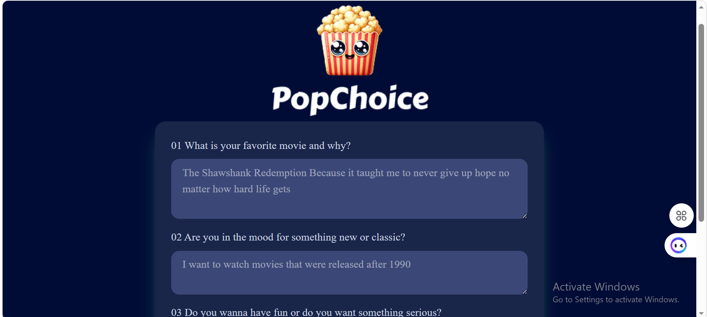

# 🎬 PopChoice - AI Movie Recommendation App

PopChoice is an AI-powered movie recommendation app that suggests movies based on user preferences using embeddings, vector search, and AI-generated explanations.

## 🚀 How to Run the App

1. Clone the repository
   git clone https://github.com/your-username/popchoice.git
2. Install dependencies
   npm install
3. Environment Variables
   Create a `.env` file in the root directory and add:
   VITE_OPENROUTER_API_KEY=your_openrouter_api_key
   VITE_SUPABASE_URL=your_supabase_url
   VITE_SUPABASE_ANON_KEY=your_supabase_anon_key
   VITE_EMBEDDING_MODEL=text-embedding-3-small
   VITE_OPENAI_MODEL=google/gemma-3-27b-it
4. Start the development server
npm run dev
# 📸 Screenshots
## Questions View

## Movie Output View

## Challenges
During devlopment, I faced several challenges:
- Understanding how embeddings and vector search work.
- Connecting React with Supabase for storing and searching movie data.
- Handling AI API requests and managing environment variables securely.
## Key Learnings 
Through this project, I learned how to:
- Use embeddings to represent user preferences as vectors.
- Perform semantic search with Supabase and pgvector.
- Integrate AI models using OpenRouter.
- Build a React application that combines AI, vector search, and personalized recommendations.
